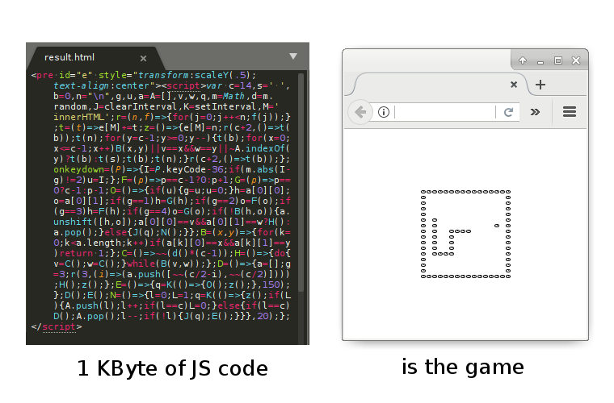

# snake-js-1kb

## What is this?
It's extra-small classic snake game, implemented on js.

## nFAQ

### Your codestyle is awful!
Yes, and in this project it acceptably and necessary.

### 1024 bytes is too large for this!
Of couse, it exists game of snake in about 100 bytes (on asm). The 1kb limitation is related with verbose nature of js and slightly traditional.

### What's next?
Dunno. Maybe 512 bytes?